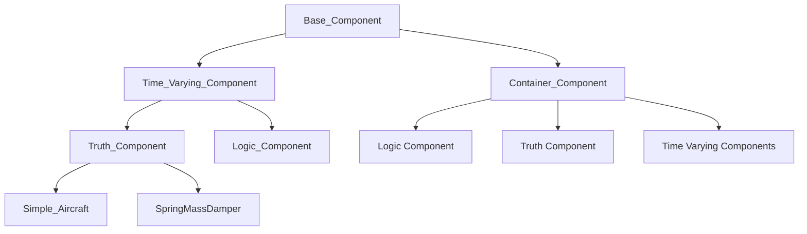
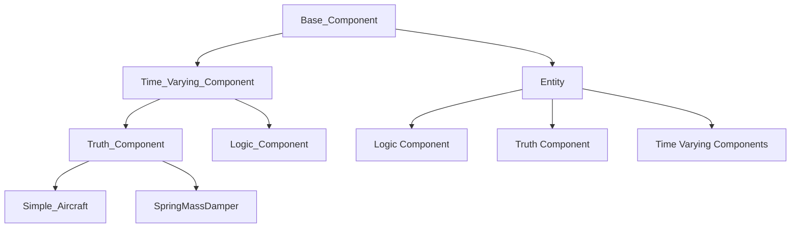
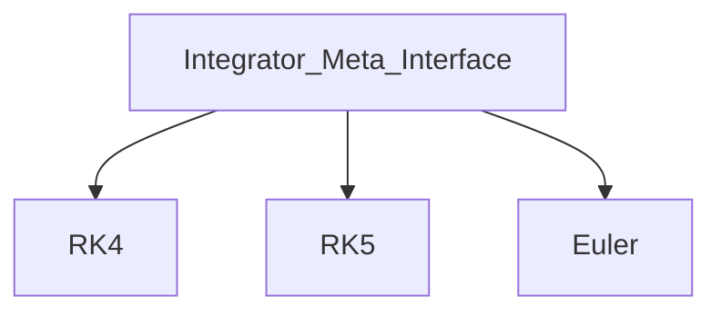

# ADCAELOS Simulation Framework Hierarchy Guide

## Section 1: Module Hierarchy

```
adcaelos/
├── components/              # Component definitions
│   ├── base_component.py
│   ├── container_component.py  → (to be renamed Entity)
│   ├── time_varying_component.py
│   ├── truth_component.py
│   ├── logic_component.py
│   ├── dynamics/
│   │   ├── simple_aircraft.py
│   │   └── spring_mass_damper.py
│   └── (future: custom component types)
│
├── integrators/             # Numerical integration
│   ├── integrator_meta_interface.py
│   ├── integrator_enums.py
│   ├── rk4.py
│   └── (future: rk5, euler, etc.)
│
├── schedulers/              # Execution management
│   ├── scheduler.py
│   ├── scheduler_enums.py
│   └── scheduler_priority_enums.py
│
├── configuration/           # NEW - Config loading
│   ├── config_loader.py
│   └── config_schema.py
│
├── serialization/           # NEW - Save/load
│   ├── serializers.py
│   └── deserializers.py
│
└── utilities/
    ├── sim_utils.py
    ├── rotations/
    │   ├── euler.py
    │   └── quaternion.py
    └── atmosphere/
        └── atmosphere_models.py
```

---

## Section 2: Component Inheritance

### Current State (Code):



### Goal State (Rename Container_Component → Entity):



---

## Section 3: Integrator Inheritance



---

## Section 4: Key Concepts

1. **Entity** - Groups related components (Truth + Logic + Time-Varying)
2. **Truth Component** - Models physics/dynamics (state integration)
3. **Logic Component** - Control algorithms (runs at fixed frequency)
4. **Time-Varying Component** - Base for time-driven execution
5. **Integrator** - Pluggable numerical methods
6. **Scheduler** - Manages simulation execution timing

---

## Section 5: Current State vs. Goal State

| Aspect | Current State | Goal State |
|--------|---------------|------------|
| Scheduler | Stub methods (pass) | Full implementation with dependency graph, topological sort |
| Entity | Named Container_Component | Renamed to Entity |
| Configuration | Not implemented | YAML/JSON/Code support |
| Serialization | Not implemented | Save/load simulation state |
| Integrator Bug | RK4 uses wrong method name | Fixed to use `statesDot()` |
| Abstract Methods | Some commented out | Properly enforced |

---

## Section 6: Known Bugs/Issues

- **RK4 Method Name Bug**: RK4 calls `getStatesDot()` but Truth_Component has `statesDot()` - this will fail at runtime
- **Scheduler Incomplete**: All methods in scheduler.py are empty stubs (pass) - cannot run simulation
- **Enum Misuse**: Priority enums use `Flag` but are used as integer values - may cause unexpected behavior
- **Abstract Methods**: Several methods marked as `@abstractmethod` have decorators commented out, making them optional rather than required
- **No Event System**: Requirements specify event-driven communication but none implemented
- **No Serialization**: No save/load functionality for simulation state
- **Incomplete Quaternion**: Only has conjugate function, missing multiplication, conversion, etc.

---

## Section 7: Pending Decisions

- **Event System**: Where should it live? How to implement?
- **Time Management**: Separate module or part of scheduler?
- **Custom Systems**: How to define processing groups?
- **Dependency Injection**: Not yet implemented

---

## Section 8: Future Considerations

- /core folder for simulation engine core
- /systems folder for custom processing systems
- Event-driven communication
- Comprehensive testing framework
- Profiling hooks
