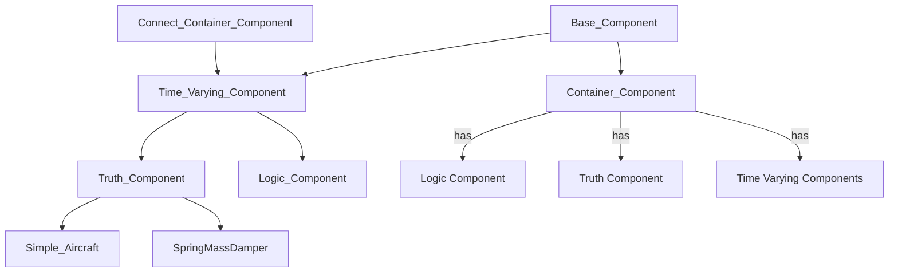
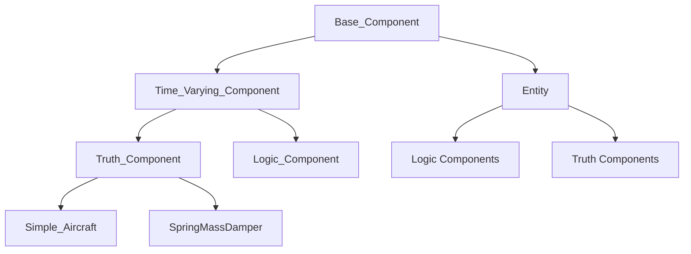
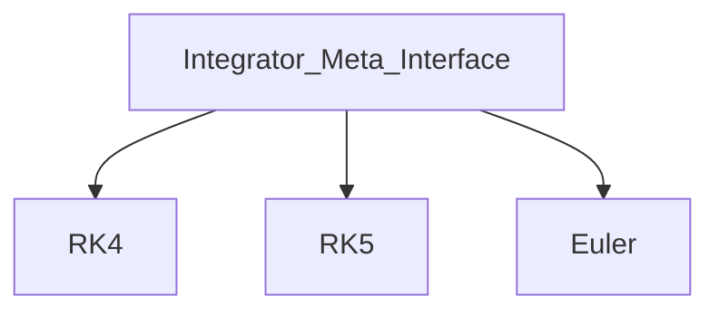

# ADCAELOS Simulation Framework Hierarchy Guide

## Section 1: Module Hierarchy

```
adcaelos/
├── components/              # Component definitions
│   ├── base_component.py
│   ├── container_component.py  → (to be renamed Entity)
│   ├── time_varying_component.py
│   ├── truth_component.py
│   ├── logic_component.py
│   ├── connect_container_component.py  # Bidirectional mixin linking components ↔ container
│   ├── data_storage.py               # State/control time-history storage
│   ├── component_enums.py            # Component type enum definitions
│   ├── dynamics/
│   │   ├── simple_aircraft.py
│   │   └── spring_mass_damper.py
│   └── (future: custom component types)
│
├── integrators/             # Numerical integration
│   ├── integrator_meta_interface.py
│   ├── integrator_enums.py
│   ├── rk4.py
│   ├── integrator_factory.py         # Factory pattern for creating integrator instances
│   └── (future: rk5, euler, etc.)
│
├── schedulers/              # Execution management
│   ├── scheduler.py
│   ├── scheduler_enums.py
│   └── scheduler_priority_enums.py
│
├── configuration/           # NEW - Config loading (not yet implemented)
│   ├── config_loader.py
│   └── config_schema.py
│
├── serialization/           # NEW - Save/load (not yet implemented)
│   ├── serializers.py
│   └── deserializers.py
│
└── utilities/
    ├── sim_utils.py
    ├── rotations/
    │   ├── euler.py
    │   └── quaternion.py
    ├── units.py             # Unit conversion utilities used by dynamics models
    └── atmosphere/
        ├── atmosphere_models.py
        └── test.py          # Atmosphere model test script
```

---

## Section 2: Component Inheritance

### Current State (Code):



### Goal State (Rename Container_Component → Entity):



---

## Section 3: Integrator Inheritance



---

## Section 4: Key Concepts

1. **Entity** - Groups related components (Truth + Logic + Time-Varying) as a **composition container** that groups related components bidirectionally via `Connect_Container_Component`
2. **Truth Component** - Models physics/dynamics (state integration)
3. **Logic Component** - Control algorithms (runs at various frequencies (guidance, navigation, control, seeker, & etc.)) - note: `Logic_Component.logicCenter` is currently optional (not enforced as abstract)
4. **Time-Varying Component** - Base for anything with time-driven execution
5. **Integrator** - Pluggable numerical methods
6. **Scheduler** - Manages simulation execution timing

### 4.1 Data_Storage

`Data_Storage` is a standalone component that manages time/value history for post-processing. It is used by `Truth_Component` to store simulation data.

**Architecture:**
- `Truth_Component` creates three `Data_Storage` instances at initialization:
  - `state_data` - stores integrable state vector time history
  - `control_data` - stores control input history (if `valid_control` enabled)
  - `other_state_data` - stores derived/non-integrated states history (if `valid_other_states` enabled)
- `Truth_Component` owns current state/control values for integration
- Each `Data_Storage` owns historical time/value series and index-name mappings

**Key Methods:**
- `store_data(current_time, data)` - stores time and values; key `0` is time, keys `1..N` correspond to variables in order
- `get_state_position_2_names()` / `get_variable_names_2_position()` - index-to-name mappings (dictionaries)
- `convert_state_position_2_names(indices)` / `convert_variable_names_2_position(indices)` - lookup helpers returning lists
- `get_all_stored_data()` - returns complete time/history dictionary
- Uses Python `array.array('d')` for memory-efficient storage (not NumPy arrays)

**Implementation Status:**
- `Data_Storage` is fully implemented and actively used by `Truth_Component`
- `get_stored_data()` method is a stub (not yet implemented) - intended for future selective label/time filtering

---

## Section 5: Current State vs. Goal State

| Aspect | Current State | Goal State |
|--------|---------------|------------|
| Scheduler | Stub methods (pass) | Full implementation with dependency graph, topological sort |
| Entity | Named Container_Component | Renamed to Entity |
| Connect_Container_Component | Implemented (composition/mixin) | Maintained as core pattern |
| Data_Storage | Implemented | Enhanced with additional features |
| Integrator_Factory | Implemented (pluggable integrator registry) | Extended with more integrator types |
| Units utility | Implemented | Expanded unit conversions |
| Configuration | Not implemented | YAML/JSON/Code support |
| Serialization | Not implemented | Save/load simulation state |
| Abstract Methods | Some commented out | Properly enforced |

---

## Section 6: Known Bugs/Issues

- **Scheduler Incomplete**:
    - have current version working
    - ~~needs improved termination criteria (off-by-one extra step)~~ **[RESOLVED]** — see below
    - vehicle-specific termination criteria (where to implement?) — still open
    - ~~**Off-by-one extra timestep**: `_time_lte_end` used `<=` so the event at exactly
      `end_time` was allowed to run `act()`, integrating one full step past the end and
      storing a spurious data point.~~ **[RESOLVED]**
        - **Fix**: Changed guard from `<=` to strict `<` and renamed helper to `_time_lt_end`.
          The event at `end_time` is now skipped; the final data point (at `end_time`) is
          correctly stored by the previous step which integrated from `(end_time − dt) → end_time`.
          Note: for variable step sizes, exact endpoint termination requires an additional
          step-clamping mechanism (future work).
    - ~~**`calculateOtherStates` time argument mismatch**: `act()` called `calculateOtherStates`
      before `set_next_time()`, so `current_time` was the *previous* step's time while
      `current_state` was already the newly integrated state. Silent bug with no runtime impact
      today (both implementations are `pass`) but would corrupt any future implementation.~~
      **[RESOLVED]**
        - **Fix**: Reordered `act()` so `set_next_time()` runs before `calculateOtherStates`,
          ensuring `current_time` always matches the time the newly integrated state represents.
- **Abstract Methods**: 
    - **PARTIALLY RESOLVED**: Abstract methods in `Truth_Component` (`statesDot`, `calculateOtherStates`) are properly enforced as `@abstractmethod`. However, `Logic_Component.logicCenter` still has `@abstractmethod` commented out (line 55), making it optional rather than required.
    - **Update needed**: Uncomment `@abstractmethod` decorator for `Logic_Component.logicCenter`
- **Event System**: Requirements specify event-driven communication
    - preliminary version implemented in Event.py
- **No Serialization**: No save/load functionality for simulation state
- **Incomplete Quaternion**: Only has conjugate function, missing multiplication, conversion, etc.
---

## Section 7: Pending Decisions

- **Dependency Injection**: Not yet implemented
    - consider sub levels of priority in the event class?
    - do I put anything inside of the component_container/entity object?
- **Event-driven communication/Between Component Communication**
    - Or 
- /core folder for simulation engine core

---

## Section 8: Future Considerations

- /systems folder for custom processing systems
- Comprehensive testing framework
- Profiling hooks
