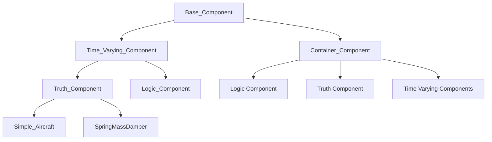
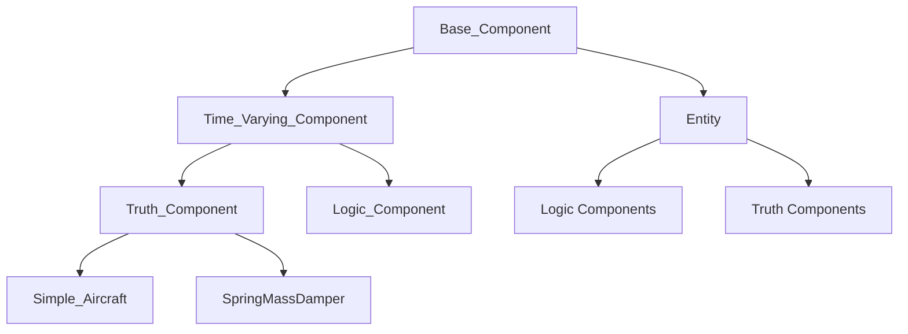
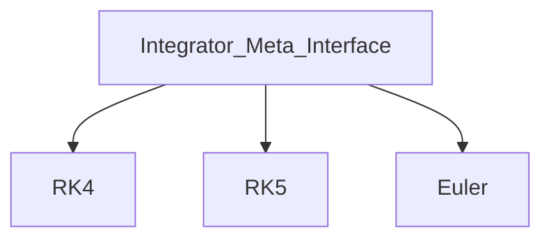

# ADCAELOS Simulation Framework Hierarchy Guide

## Section 1: Module Hierarchy

```
adcaelos/
├── components/              # Component definitions
│   ├── base_component.py
│   ├── container_component.py  → (to be renamed Entity)
│   ├── time_varying_component.py
│   ├── truth_component.py
│   ├── logic_component.py
│   ├── dynamics/
│   │   ├── simple_aircraft.py
│   │   └── spring_mass_damper.py
│   └── (future: custom component types)
│
├── integrators/             # Numerical integration
│   ├── integrator_meta_interface.py
│   ├── integrator_enums.py
│   ├── rk4.py
│   └── (future: rk5, euler, etc.)
│
├── schedulers/              # Execution management
│   ├── scheduler.py
│   ├── scheduler_enums.py
│   └── scheduler_priority_enums.py
│
├── configuration/           # NEW - Config loading
│   ├── config_loader.py
│   └── config_schema.py
│
├── serialization/           # NEW - Save/load
│   ├── serializers.py
│   └── deserializers.py
│
└── utilities/
    ├── sim_utils.py
    ├── rotations/
    │   ├── euler.py
    │   └── quaternion.py
    └── atmosphere/
        └── atmosphere_models.py
```

---

## Section 2: Component Inheritance

### Current State (Code):



### Goal State (Rename Container_Component → Entity):



---

## Section 3: Integrator Inheritance



---

## Section 4: Key Concepts

1. **Entity** - Groups related components (Truth + Logic + Time-Varying)
2. **Truth Component** - Models physics/dynamics (state integration)
3. **Logic Component** - Control algorithms (runs at various frequencies (guidance, navigation, control, seeker, & etc.))
4. **Time-Varying Component** - Base for anything with time-driven execution
5. **Integrator** - Pluggable numerical methods
6. **Scheduler** - Manages simulation execution timing

---

## Section 5: Current State vs. Goal State

| Aspect | Current State | Goal State |
|--------|---------------|------------|
| Scheduler | Stub methods (pass) | Full implementation with dependency graph, topological sort |
| Entity | Named Container_Component | Renamed to Entity |
| Configuration | Not implemented | YAML/JSON/Code support |
| Serialization | Not implemented | Save/load simulation state |
| Abstract Methods | Some commented out | Properly enforced |

---

## Section 6: Known Bugs/Issues

- **Scheduler Incomplete**:
    - have current version working
    - needs improved termination criteria
    - vehicle specific termination criteria (where to implement?)
    - ~~**Numerical Precision** problem with `set_next_time()` inside of `time_varying_component.py`~~ **[RESOLVED]**
        - ~~leads to scheduler skipping steps or adding additional steps~~
        - ~~leads to integration problems as either the `dt` or the `currTime` is off~~
        - **Fix**: Replaced additive accumulation with an integer step counter (`next_time = start_time + step_count / frequency`), eliminating floating-point drift regardless of step count. Added `set_frequency()` with re-anchor support and configurable `end_time_tolerance` in `Scheduler`. See `documentation/plans/DONE_fix_numerical_drift_error.md`.
- **Enum Misuse**: Priority enums use `Flag` but are used as integer values - may cause unexpected behavior
    - `scheduler_priority_enums.py` have been updated
    - unsure if other enums need to switch - currently set as `Auto()` for the following:
    - `integrator_enums.py`
        - `component_enums.py`
        - `scheduler_enums.py`
- **Abstract Methods**: Several methods marked as `@abstractmethod` have decorators commented out, making them optional rather than required
- **Event System**: Requirements specify event-driven communication
    - preliminary version implemented in Event.py
- **No Serialization**: No save/load functionality for simulation state
- **Incomplete Quaternion**: Only has conjugate function, missing multiplication, conversion, etc.
---

## Section 7: Pending Decisions

- **Custom Systems**: How to define processing groups?
- **Dependency Injection**: Not yet implemented
    - consider sub levels of priority in the event class?
    - do I put anything inside of the component_container/entity object?
- **Event-driven communication/Between Component Communication**
    - Or 
- /core folder for simulation engine core

---

## Section 8: Future Considerations

- /systems folder for custom processing systems
- Comprehensive testing framework
- Profiling hooks
